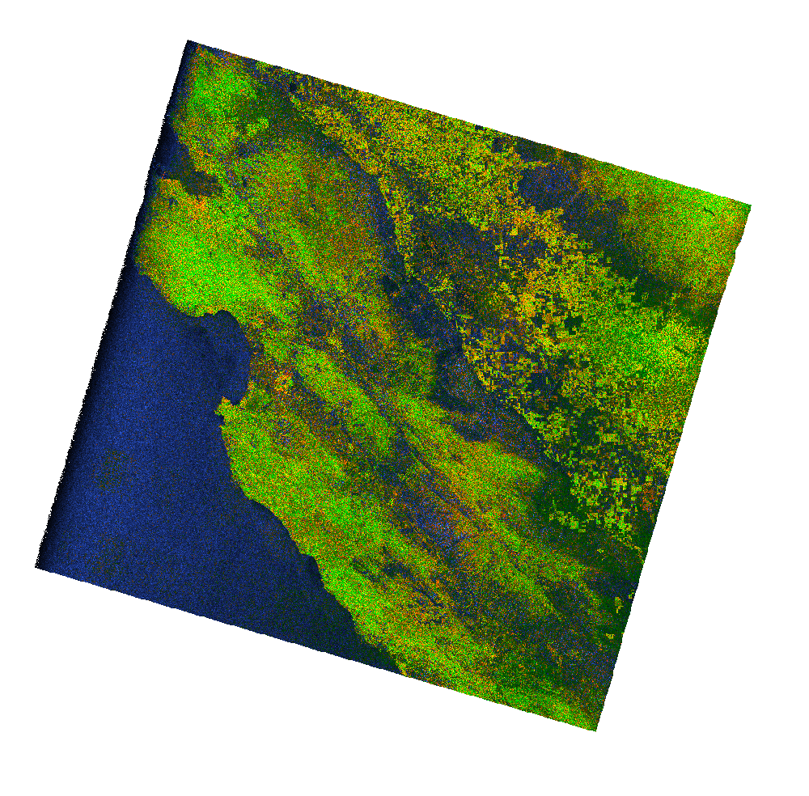

# nisar-py

NISAR data transformations.

## Developer setup

```
mamba env create -f environment.yml
mamba activate nisar-py
pip install -e .
pytest
```

## GCOV RGB

The [`nisar_py.gcov_rgb`](./src/nisar_py/gcov_rgb.py) module converts a dual-pol or quad-pol GCOV product
to a false color RGB decomposition of the co- and cross-polarized data in Cloud Optimized GeoTIFF format,
and was adapted from [`hyp3lib.rtc2color`](https://github.com/ASFHyP3/hyp3-lib/blob/develop/src/hyp3lib/rtc2color.py). 
Quad-pol GCOV products will use HH and HV for the co- and cross-polarized data inputs. 
The RGB decomposition algorithm is described [here](https://github.com/ASFHyP3/hyp3-lib/blob/develop/docs/rgb_decomposition.md). 

Single-pol GCOV images can also be colorized, but they will be based on a color bar for the single polarization available. Note that color interpretation will differ between the single-pol and dual-pol outputs.

To use the module, make sure you're working within the `nisar-py` conda/mamba environment,
as shown in [developer setup](#developer-setup). Then call `make_rgb_geotiff`, e.g:

```python
from nisar_py.gcov_rgb import make_rgb_geotiff
from pathlib import Path

make_rgb_geotiff(
    gcov_product=Path('NISAR_L2_PR_GCOV_004_042_D_070_4005_DHDH_A_20251101T025640_20251101T025714_X05009_N_F_J_001.h5'),
    output_path=Path('.'),
    frequency='A',
)
```

The above example produces an image like the one below:


